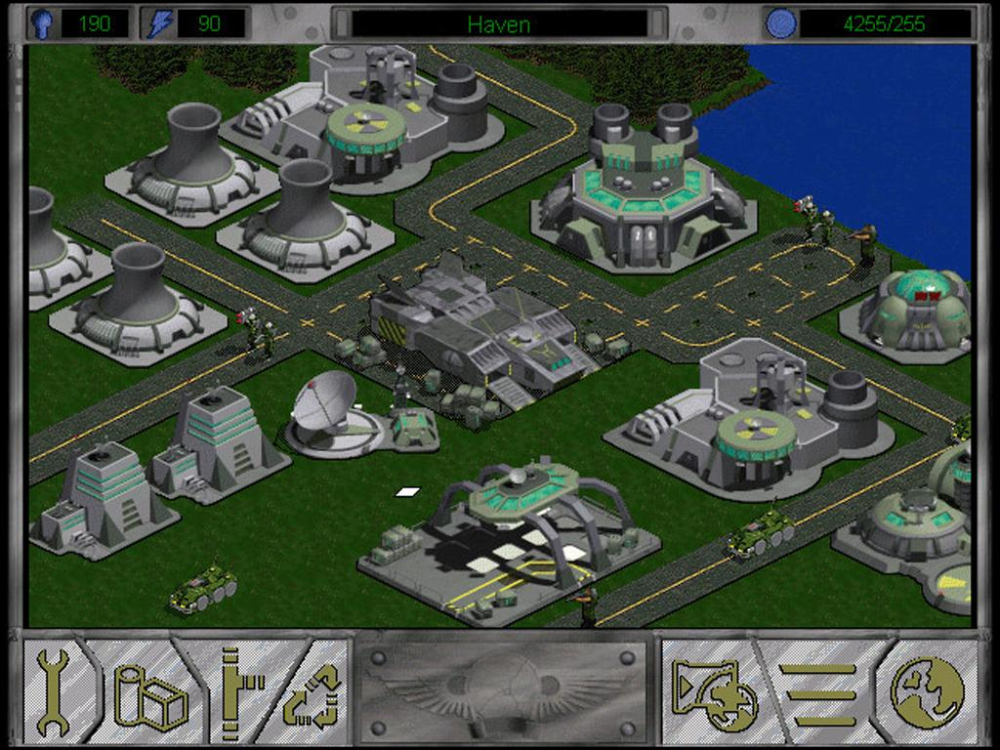

# Fallen Haven

This is an attempt to make a modern web-based version of the 1997 game, Fallen Haven.

## Running Locally

```bash
cd frontend
npm install
npm start
```

The frontend is written in Javascript and uses the excellent [Phaser](https://phaser.io/) framework



## Production Deployment

The Javascript frontend is built using [webpack](./frontend/config/webpack.prod.js) to produce a static bundle that can be deployed to any CDN.

The game is [currently running](https://fallenhaven.jasoncabot.me) on Azure Kubernetes Service.

It's a static nginx server [configured](./frontend/nginx.conf) to serve a static website where the Kubernetes Deployment, Service and Ingress are defined in this [manifest](./manifests/frontend.yaml)

Everything is deployed automatically using [GitHub Actions](./.github/workflows/build-deploy-frontend.yml) and an Azure Service Principal
