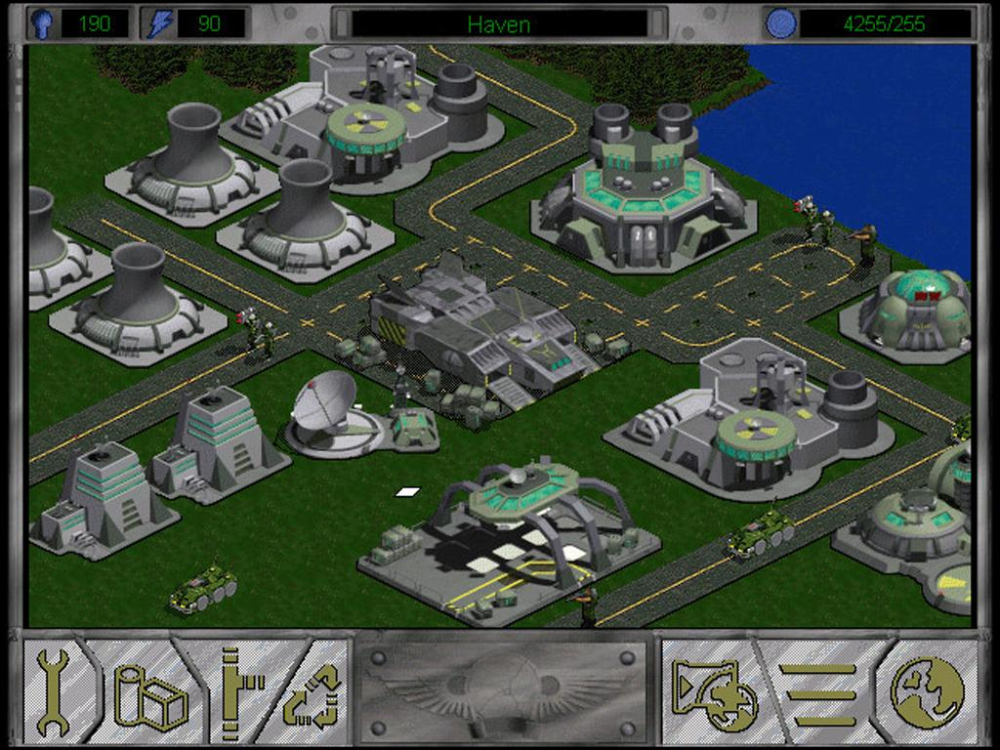

# Fallen Haven

This is an attempt to make a modern web-based version of the 1997 game, Fallen Haven.

## Running Locally

The game is built in two halves. The frontend, written in Javascript using the excellent [Phaser](https://phaser.io/) framework and a backend Node and express web server.

Both can be run independently with or without the other.

To run the frontend locally you must set the appropriate environment variables in a file `./frontend/.env`

```bash
API_ENDPOINT=http://localhost:4500
ASSET_ENDPOINT=/assets/data
WEBGL_RENDERER=true
CANVAS_RENDERER=true
```

Then you can run the frontend with a standard `npm start`

```bash
cd frontend
npm install
npm start
```

The backend connects to a Redis instance for persistent (ish) storage. You'll need to again set the appropriate values in `./backend/.env` such as


```bash
REDIS_HOST=redis.host.dns.name
REDIS_KEY=access.key
REDIS_PORT=6280
PORT=4500
```

Then you can run the backend with either `npm start` to run without reloading or `npm run start:dev` if you want the server to hot-reload with changes.

```bash
cd backend
npm install
npm run start:dev
```




## Production Deployment

* Frontend is React + Phaser on Cloudflare Pages
* Shared library is Typescript and data encoded as Flatbuffers that can be imported on either front or backend
* Backend is Typescript and Node on Cloudflare Workers
